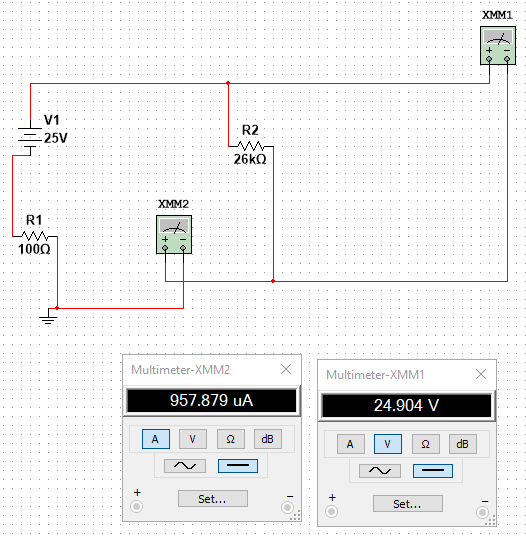

# ЛАБОРАТОРНАЯ РАБОТА 1
# «ЭЛЕМЕНТЫ ЭЛЕКТРИЧЕСКИХ ЦЕПЕЙ»

## Эксперимент 1
Измерить напряжение идеального источника ЭДС. Построить схемы цепей в Multisim. Нарисовать график зависимости напряжения от тока.
### Дано:
Е1 = 25в Е2 = 28в Е3 = 30в

|Напряжение В   | Ток мА|
|------------|----------|
|25          | 25       |
|28          | 28       |
|30          | 30       |

## Эксперимент 2
Измерить сопротивление. Построить схему цепи в Multisim.

## Эксперимент 3
Измерить и вычислить общее сопротивление при параллельном, последовательном и
смешанном соединениях резисторов. Построить схемы цепей в Multisim. Убедиться, что значения сопротивлений, вычисленные при помощи формул и измеренные программой, совпадают.
### Дано
R1 = 25кОм R2 = 26кОм R3 = 27кОм

Rэ = 78кОм

Rэ = 8.658

Rэ = 39.745

## Эксперимент 4
Составить схему цепи в Multisim. Построить ВАХ сопротивления.

### Дано
Rн = 25кОм E1 = 25В E2 = 28В E3 = 30В

## Эксперимент 5
Построить ВАХ реального источника ЭДС. Для этого провести опыты холостого хода и короткого замыкания. Составить схему цепи в Multisim.
### Дано:
E = 25В Rвн = 100Ом

## Эксперимент 6
Определить рабочую точку реального источника ЭДС при его работе на нагрузку:
- измерить ток и напряжение на нагрузке;
- построить на одном графике ВАХ сопротивления и реального источника ЭДС;
- убедиться, что показания приборов соответствуют показаниям графика, составить схему цепи в Multisim.
Дано: 
En1 = 25v Rbh = 100om Rh = 25kOm

## Эксперимент 7
Проанализировать изменения положения рабочей точки при изменении напряжения, внутреннего сопротивления и сопротивления нагрузки. Составить схемы цепей в Multisim. Сравнить результаты эксперимента с расчѐтами цепей.
Дано:
E1=25v E2=28v E3=30v Rbh=100Om Rh=25ROm
#### Изменение ЭДС

#### Изменение внутреннего сопротивления

#### Изменение сопротивления нагрузки

## Эксперимент 8
Bсследовать реальный источник тока. Составить схемы цепей в Multisim. Построить
ВАХ реального источника тока.
Дано:
I=1A Rbh=100Om

## Эксперимент 9
Исследовать поведение характеристик индуктивности и ёмкости на постоянном токе.
Составить схемы цепей в Multisim. Для индуктивности: убедиться, что вольтметр показывает
«0» при наличии тока, т.е. сопротивление индуктивности равно «0». Для ёмкости: убедиться,
что амперметр показывает «0», что означает разрыв цепи, т.е. сопротивление ёмкости равно.
Дано: 
E=25v Rh=100Om L=10mGn C=10mkF

## Эксперимент 10
Построить делитель напряжения. Составить схему цепи в Multisim. Сравнить расчѐты,
сделанные программой, с расчѐтами, сделанными вручную при помощи формул.
Дано: 
E=25v R1=100om R2=200om

## Эксперимент 11
Построить делитель тока, cоставить схему цепи в Multisim, сравнить расчѐты,
сделанные программой, с расчѐтами, сделанными вручную при помощи формул.
Дано: 
I=1A R1=120Om R2=240Om

